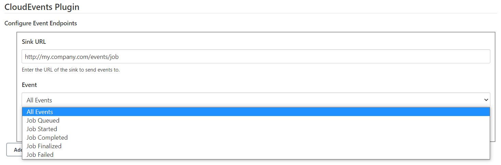
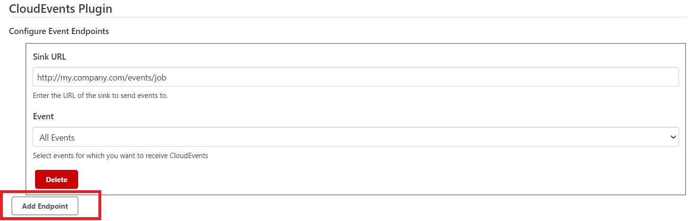

# CloudEvents-Plugin

## Introduction

The CloudEvents Plugin for Jenkins allows interoperability between different CI/CD tools by adopting industry-standard specification for events called [CloudEvents](https://cloudevents.io/). By using this plugin in your workflows, you can emit and consume CloudEvents for various events in Jenkins relating to Jenkins objects (jobs, projects, queues, etc).

## Getting started

There are 2 usages of this plugin:
1. **Jenkins as a Source.**
   
    1. To configure Jenkins as a Source, first click on *Manage Jenkins* in the Root-Actions menu on the left.
        
       
    2. Once you are in Manage Jenkins UI, search for *Configure System* under *System Configuration*. 
        
       
    3.  Inside the *Configure System* UI, scroll down to the *CloudEvents Plugin* section. 
        Here, each block represents an endpoint, which comprises a valid Sink-URL and type of event
        that URL is configured to receive.
        - Select HTTP Sink URL.
        - Select an event from the dropdown which will be sent to the sink you have configured.
        
        
          
    4. You can also add more endpoints and configure them similarly. 
        This way, each endpoint can be configured to receive specific events.
       

2. **Jenkins as a Sink.**
    1. To use Jenkins as a Sink, simply enter the Jenkins Sink URL as the Sink to send CloudEvents from other systems.
    2. TODO: Jenkins Sink URL.

## Issues

TODO Decide where you're going to host your issues, the default is Jenkins JIRA, but you can also enable GitHub issues,
If you use GitHub issues there's no need for this section; else add the following line:

Report issues and enhancements in the [Jenkins issue tracker](https://issues.jenkins-ci.org/).

## Contributing

TODO review the default [CONTRIBUTING](https://github.com/jenkinsci/.github/blob/master/CONTRIBUTING.md) file and make sure it is appropriate for your plugin, if not then add your own one adapted from the base file

Refer to our [contribution guidelines](https://github.com/jenkinsci/.github/blob/master/CONTRIBUTING.md)

## LICENSE

Licensed under MIT, see [LICENSE](LICENSE.md)

